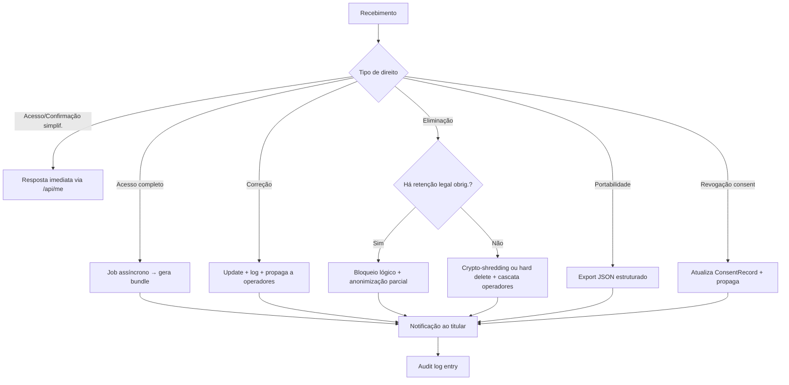

# DSAR — Direitos do Titular (Art. 18 LGPD)

Implementação dos 9 direitos do titular com SLA de **15 dias corridos** (Art. 19, II) para resposta completa. Para ATPP, **30 dias** (Res. 2/2022, Art. 14).

## Os 9 direitos

| # | Direito (Art. 18) | Endpoint sugerido | SLA |
|---|---|---|---|
| I | Confirmação de existência | `GET /api/me` | imediato |
| II | Acesso aos dados | `GET /api/me/export` | imediato (simplificado) / 15d (completo) |
| III | Correção de dados | `PATCH /api/me/profile` | imediato |
| IV | Anonimização/bloqueio/eliminação de dados desnecessários | manual (ticket) | 15d |
| V | Portabilidade | `GET /api/me/export?format=portable` | 15d |
| VI | Eliminação dos dados (revogação de consentimento) | `POST /api/me/erasure` | 15d |
| VII | Informação sobre compartilhamento | já na política / `GET /api/me/sharing` | imediato |
| VIII | Informação sobre não consentir | já na política / signup | imediato |
| IX | Revogação de consentimento | `POST /api/consent/revoke` | imediato |

## Workflow

### Intake

3 canais mínimos:
1. **API self-service** (titular autenticado)
2. **Formulário web** para titulares não-logados ou casos especiais
3. **Canal do Encarregado** (e-mail) — sempre obrigatório (Res. 18/2024)

### Verificação de identidade

- Titular autenticado → suficiente.
- Titular não autenticado → mínimo necessário (não onere). Verificação por e-mail/SMS associado é geralmente suficiente.
- **NÃO peça mais dados pessoais como condição** — princípio da necessidade (Art. 6º, III).

### Fluxo de fulfillment



### Cuidados específicos

**Eliminação (Art. 18, VI) vs. retenção legal (Art. 16):**
- Fiscal: 5 anos (CTN Art. 174 + outras)
- Trabalhista: 5 anos
- Bancário: 10 anos (CMN)
- Marco Civil: 6 meses para logs (Lei 12.965/2014)
- LGPD não revoga essas obrigações → bloqueio (não eliminação) durante o prazo, eliminação após.

**Portabilidade (Art. 18, V):**
- Formato estruturado e interoperável (JSON canonicalizado, CSV, XML).
- "Segredo comercial e industrial" pode restringir partes (Art. 19, II).
- Não inclui dados inferidos pelo controlador (ponto controverso — incluir é boa-fé).

**Revisão de decisão automatizada (Art. 20):**
- Implementar endpoint dedicado se o produto usa decisões automatizadas que afetam o titular (credit scoring, content moderation, recommendation com impacto material).
- Após Lei 13.853/2019, não há obrigação explícita de revisor humano — mas é boa prática.

## Endpoint specs

Ver `assets/endpoints.md` para implementação detalhada em Next.js / React Native.

## Audit logging obrigatório

Cada DSAR gera entradas em `AuditLogEntry`:
- `DSAR_RECEIVED`
- `DSAR_IDENTITY_VERIFIED`
- `DSAR_FULFILLED` (com hash do payload entregue)
- `DSAR_REJECTED` (com motivo)

Mantenha por **5 anos no mínimo** (prova de conformidade + alinhamento com Art. 10 Res. 15/2024).

## UI mobile / web

- Tela "Meus Dados" sempre acessível no menu de configurações
- Botões claros: Exportar | Corrigir | Excluir | Gerenciar Consentimentos
- Confirmação dupla para eliminação (proteção contra clique acidental)
- Indicador de status do pedido em andamento

## Status update

```markdown
## F5 — DSAR ✓
- Endpoints: {lista implementada}
- UI mobile: tela /privacy implementada
- SLA configurado: 15 dias com alertas em 10 e 13 dias
- Backlog atual: 0 pedidos abertos
- Próximo: lgpd-audit-logging
```
