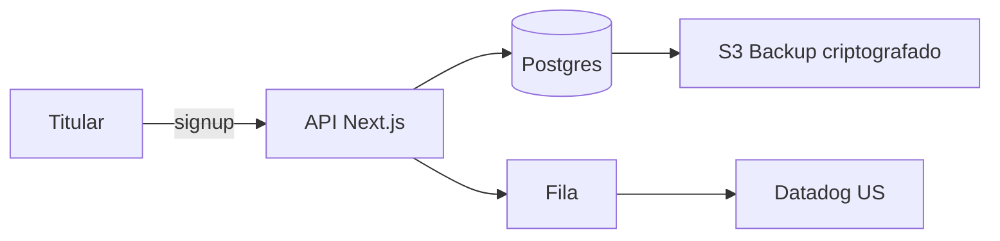

# RIPD — Relatório de Impacto à Proteção de Dados

**Atividade**: {nome}
**Slug**: {ripd-slug}
**Controlador**: {nome jurídico}
**Encarregado**: {nome}
**Equipe**: {nomes}
**Versão**: v{N} | **Data**: {data}

---

## 1. Sumário executivo

{2-3 parágrafos. O que o tratamento faz, por que precisa de RIPD, qual o resultado da avaliação.}

## 2. Contexto

- Produto/feature:
- Stakeholders:
- Volume de titulares estimado:
- Início previsto / atual:

## 3. Descrição do tratamento

### 3.1 Fluxo de dados

### 3.2 Sistemas envolvidos
- Frontend: ...
- Backend: ...
- Banco: ...
- Cache: ...
- Filas/streams: ...
- Observabilidade: ...

### 3.3 Operadores
- {Operador A} — `.lgpd/vendors/{a}.md`
- {Operador B} — `.lgpd/vendors/{b}.md`

## 4. Necessidade e proporcionalidade

- A finalidade pode ser atingida com menos dados? {análise}
- Alternativas avaliadas: {lista}
- Razão da escolha: {justificativa}

## 5. Princípios LGPD (Art. 6)

| Princípio | Como é atendido |
|---|---|
| I — Finalidade | {específica e declarada na política} |
| II — Adequação | {compatibilidade com expectativa do titular} |
| III — Necessidade | {minimização — campos coletados} |
| IV — Livre acesso | {DSAR endpoint, self-service} |
| V — Qualidade | {validação, correção} |
| VI — Transparência | {política, dashboard de privacidade} |
| VII — Segurança | {medidas técnicas} |
| VIII — Prevenção | {threat modeling, pentest} |
| IX — Não discriminação | {avaliação de viés se houver IA} |
| X — Responsabilização | {audit log, governança} |

## 6. Base legal

- Art. {7º/11}, inciso {N}: {justificativa}
- LIA (se Art. 7º, IX): `.lgpd/lia/{slug}.md`

## 7. Direitos do titular

| Direito (Art. 18) | Como é exercido |
|---|---|
| I — Confirmação de existência | endpoint `/api/me` |
| II — Acesso | `/api/me/export` |
| III — Correção | `/api/me/profile` |
| IV — Anonimização/bloqueio/eliminação | `/api/me/erasure` |
| V — Portabilidade | export em JSON estruturado |
| VI — Eliminação consentida | `/api/me/erasure` |
| VII — Compartilhamento | listado na política + ROPA |
| VIII — Possibilidade de não consentir | banner com opt-in/opt-out |
| IX — Revogação | `/api/me/consent/revoke` |

## 8. Identificação e tratamento de riscos

### 8.1 Matriz de riscos

| ID | Risco | P (1-5) | I (1-5) | Nível | Mitigação | Status | Risco residual |
|---|---|---|---|---|---|---|---|
| R001 | Vazamento via SDK Datadog | 2 | 4 | 8 | mascaramento PII pré-envio | mitigado | 2 |
| R002 | Acesso indevido de funcionário | 2 | 5 | 10 | RBAC + audit log + treinamento | mitigado | 3 |
| R003 | Re-identificação em export agregado | 3 | 3 | 9 | k-anonymity ≥ 5 | mitigado | 2 |

### 8.2 Riscos não mitigáveis

{Se houver — explicar por que e qual a decisão.}

## 9. Salvaguardas técnicas

- [ ] TLS 1.3 em trânsito
- [ ] TDE / criptografia em repouso
- [ ] Pseudonimização de IDs em logs
- [ ] RBAC + princípio do menor privilégio
- [ ] MFA para acesso admin
- [ ] Audit log imutável
- [ ] Segregação de redes/contas
- [ ] Backups criptografados + teste de restore
- [ ] Pentest anual
- [ ] Monitoramento de vazamento (DLP, threat intel)

## 10. Salvaguardas administrativas

- [ ] Política de segurança da informação
- [ ] Treinamento LGPD anual
- [ ] NDA para funcionários e operadores
- [ ] Processo de offboarding
- [ ] Plano de resposta a incidente
- [ ] DPA com todos os operadores

## 11. Consulta a partes interessadas

- Titulares: {pesquisa realizada / N participantes / data}
- Encarregado: revisão em {data}
- Jurídico: revisão em {data}
- Segurança: revisão em {data}

## 12. Decisão

- [x] Prosseguir como planejado
- [ ] Prosseguir com modificações
- [ ] Não prosseguir
- [ ] Consultar ANPD

**Justificativa**: {texto}

**Aprovado por**:
- Encarregado: {nome} — {data}
- Patrocinador do produto: {nome} — {data}

## 13. Plano de revisão

- Próxima revisão obrigatória: {data}
- Gatilhos para revisão antecipada:
  - Mudança de finalidade
  - Nova categoria de dado
  - Novo operador
  - Incidente relacionado
  - Crescimento > 50% na base de titulares
